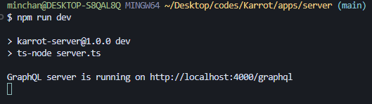
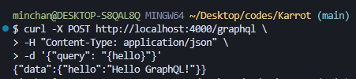
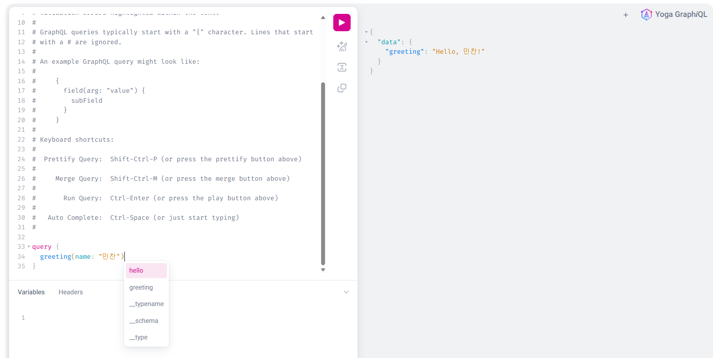

# Week 1 - Day 2: GraphQL SDL 심화 & 선언자 정리

## 🎯 오늘의 목표
- SDL의 주요 선언자와 역할 이해
- Enum, Input, Union, Schema 병합 개념 학습
- GraphQL 리졸버 인자 구조 파악 (`parent`, `args`, `context`, `info`)
- 실행 가능한 예제 코드 작성

---

## 📸 실행 화면
### 서버 실행


### 첫 쿼리 실행 (curl)


### GraphiQL로 쿼리 실행
 

---

## 🐛 시행착오 기록
1. `!` 연산자 오해
    - 시도: SDL에서 !가 unique 제약을 의미한다고 생각
    - 문제: 실제로는 Non-Null 제약이었음 (값이 반드시 존재해야 함)
    - 해결: 공식 문서 확인 후 의미를 수정
    - 배운 점: GraphQL SDL의 !는 unique와 무관, 단순히 null 허용 여부를 명시

2. Enum 동작 방식 오해
    - 시도: GraphQL Enum을 JS/TS Numeric Enum처럼 0, 1, 2 인덱스로 접근 가능하다고 생각
    - 문제: GraphQL Enum은 문자열 리터럴 기반이며, "ADMIN"(문자열) 전달 시 타입 불일치 에러 발생
    - 해결: Enum은 쿼리에서 ADMIN처럼 따옴표 없이 작성, Variables에서는 {"role":"ADMIN"}로 전달
    - 배운 점: GraphQL Enum은 AST에서 EnumValue로 처리되어 문자열 리터럴과 구분됨

3. MSA 접근 혼동
    - 시도: 하나의 통합된 GraphQL 스키마가 복수 서버 위에서 미들웨어처럼 작동한다고 이해
    - 문제: GraphQL 자체 기능이 아니라, 게이트웨이/스키마 스티칭을 통해 구현하는 구조였음
    - 해결: Apollo Federation, GraphQL Mesh 등을 통해 서비스별 스키마 병합 후 게이트웨이에서 통합 처리
    - 배운 점: GraphQL 서버는 하나의 스키마만 이해하므로, MSA 환경에서는 스키마 병합 레이어가 필요


## 📌 TIL
### GraphQL SDL 주요 선언자
| 선언자 | 설명 | 예시 |
|--------|------|------|
| `type` | 객체 타입을 정의 | `type User { id: ID!, name: String! }` |
| `input` | 쿼리/뮤테이션의 입력 타입을 정의 | `input CreateUserInput { name: String!, role: Role! }` |
| `enum` | 제한된 리터럴 값 집합 정의 | `enum Role { ADMIN, USER, GUEST }` |
| `union` | 여러 객체 타입 중 하나를 반환 | `union SearchResult = User \| Post` |
| `Query` | 읽기 전용 API 엔드포인트 집합 | `type Query { users: [User!]! }` |
| `Mutation` | 데이터 변경 API 엔드포인트 집합 | `type Mutation { createUser(...): User! }` |
| `Subscription` | 실시간 데이터 스트리밍 엔드포인트 집합 | `type Subscription { ... }` |
| `schema` | 루트 타입 지정 | `schema { query: Query, mutation: Mutation }` |


### Enum
- TS의 유니온 타입처럼 동작하며, 허용된 값 중 하나를 선택
- 네트워크 전송 시 문자열로 직렬화
- 쿼리에서는 `ADMIN`처럼 따옴표 없이 작성
- Variables 사용 시: `{"role":"ADMIN"}`
- AST에서 Enum 값은 `EnumValue`로 파싱되어 문자열 리터럴과 구분됨

### 리졸버 인자 구조
```ts
(parent, args, context, info)
```
- **parent**: 상위 타입 리졸버 결과 (루트에서는 `{}` 또는 `null`)
- **args**: 쿼리 인자 객체
- **context**: 요청 전역 공유 데이터
- **info**: 실행 계획, AST 등 메타데이터
- 사용하지 않는 인자는 `_`와 `unknown` 타입으로 처리

### parent 인자 활용 예시
```ts
User: {
  // parent = 상위 User 객체
  posts: (parent) => posts.filter(p => p.authorId === parent.id)
},

Post: {
  // parent = 상위 Post 객체
  author: (parent) => users.find(u => u.id === parent.authorId)
}
```

### 스키마 병합
- GraphQL 서버는 하나의 통합 스키마만 이해
- 기능별 SDL을 분리 작성 후 병합 필요
- MSA에서는 게이트웨이 레이어에서 스키마 스티칭 또는 Federation 사용